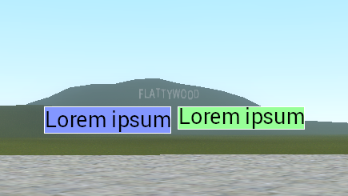
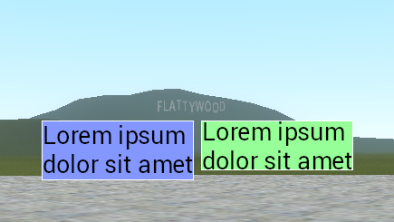

# surface.GetVisualCharacterHeight
###### (or surface.GetVisualTextHeight)

Calculates the visual height of provided characters (or text).

Extremely useful for accurately and neatly positioning text by height.

### `GetTextSize` vs `GetVisualCharacterHeight`



```lua
local Font = 'DermaLarge'
local Chars = "Lorem ipsum"
-- local Chars = "Lorem ipsum\ndolor sit amet"

local COL1 = Color( 130, 150, 255 )
local COL2 = Color( 150, 255, 150 )

hook.Add( 'HUDPaint', "GetVisualCharacterHeightDemo", function()

	surface.SetFont( Font )

	local w, h = surface.GetTextSize( Chars )

	local x = ScrW() * 0.5 - w - 5
	local y = ScrH() * 0.5

	surface.SetDrawColor( 255, 255, 255 )
	surface.DrawOutlinedRect( x - 1, y - 1, w + 2, h + 2 )

	surface.SetDrawColor( COL1 )
	surface.DrawRect( x, y, w, h )

	draw.DrawText( Chars, Font, x, y, color_black )

	x = ScrW() * 0.5 + 5

	local visualheight, roofheight = surface.GetVisualCharacterHeight( Chars, Font )

	surface.SetDrawColor( 255, 255, 255 )
	surface.DrawOutlinedRect( x - 1, y - 1, w + 2, visualheight + 2 )

	surface.SetDrawColor( COL2 )
	surface.DrawRect( x, y, w, visualheight )

	y = y - roofheight
	draw.DrawText( Chars, Font, x, y, color_black )

end )
```
